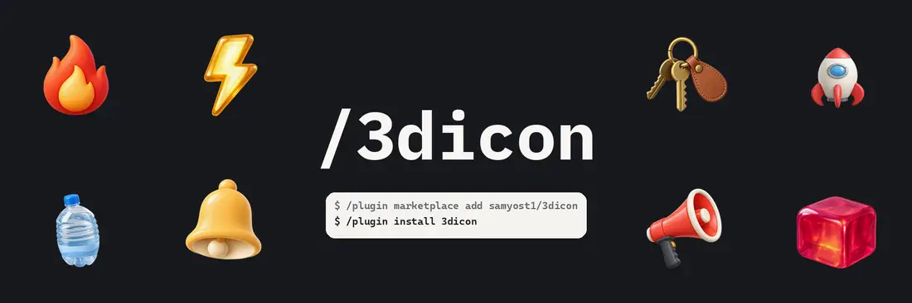
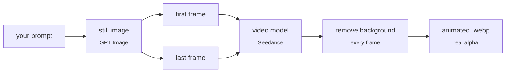

# /3dicon

**One prompt in, a looping animated 3D icon out** (with real transparency) an animated WebP you can drop straight into your app UI.

<p align="center">
  
</p>


## Install

```
/plugin marketplace add samyost1/3dicon
/plugin install 3dicon
```

One OpenRouter key covers the whole pipeline — the image model and the video
model both run through it.

```bash
cd ~/.claude/skills/3dicon
pip install -r requirements.txt
cp .env.example .env
```

Put your key in `.env`:

```
OPENROUTER_API_KEY=sk-or-...
```

Get one at [openrouter.ai/keys](https://openrouter.ai/keys).

`ffmpeg` must be on PATH. The first run downloads a ~180MB matting model.

## Use

Ask for it in plain words:

> make an animated 3d fire icon using /3dicon

It generates one still, shows it, and waits for you to approve it before
spending anything on motion. Then it proposes the motion and waits again.

## How it works



The trick is in the middle: **the same still is sent as both the first and the
last frame**, so the model returns to where it began and the loop closes with
no visible seam.

The background is removed against a colour we chose ourselves, which means the
original colours can be solved for exactly rather than guessed — that is what
keeps soft edges soft instead of leaving a halo.

## Licence

MIT. Icons you generate with it are yours, with no restrictions.
