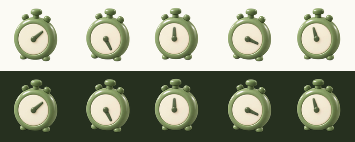

# animated-3d-icon

Turn a prompt into a looping animated icon with **real transparency**.

<p align="center">
  
</p>

GPT Image, Nano Banana or OpenRouter for the art → Kling 3.0 via OpenRouter
for the motion → exact-unpremultiply matting for the alpha → animated WebP out.

No Lottie conversion. A "video to Lottie" tool just embeds the same raster
frames as base64 inside a JSON, which is bigger than the WebP and buys nothing —
Lottie's advantage is vector, and a glossy 3D render will not vectorise.

## Install

```bash
pip install -r requirements.txt
cp .env.example .env     # fill in the backend you want
```

Needs `ffmpeg` on PATH. Matting downloads a ~180MB model on first run.

## Use

```bash
python -m iconloop --out out still   --prompt "a 3D stopwatch, sage green and cream"
python -m iconloop --out out animate --motion "rocks gently, hand sweeping clockwise"
python -m iconloop --out out matte
python -m iconloop --out out encode --sweep      # see what each frame rate costs
python -m iconloop --out out encode --size 288 --name timer
python -m iconloop --out out verify
```

Stages are separate because each is a place to look before spending the next
thing. `run` chains them if you want that.

## Backends

| backend | key | notes |
|---|---|---|
| `openai` | `OPENAI_API_KEY` | resolves the newest `gpt-image-*` on your account at runtime |
| `gemini` | `GOOGLE_API_KEY` | Nano Banana image models |
| `openrouter` | `OPENROUTER_API_KEY` | one key for both, via the unified Image API; set `ICONLOOP_IMAGE_MODEL` |

Animation goes through OpenRouter on `kwaivgi/kling-v3.0-pro` by default;
`--model` swaps it, `--via replicate` falls back to Kling 2.5.

## The three ideas worth stealing

1. **`end_image` = the start image.** Kling returns to its opening pose, so the
   loop closes instead of ping-ponging.
2. **Composite onto a backing you chose.** Then solve
   `C = (F − (1−a)·BG)/a` exactly instead of estimating the foreground. Edge
   error 26.9 → 15.9 against ground truth.
3. **Encode at the source frame rate.** Downsampling to hit a size target is
   what makes these look broken. `--sweep` shows the real cost.

## Limits

The contact shadow does not survive matting, file size scales with frame count,
transparent MP4 needs an x265 build most distros don't ship, and animated WebP
can't honour reduced-motion. All measured in [docs/limitations.md](docs/limitations.md).

## Licence

MIT.
