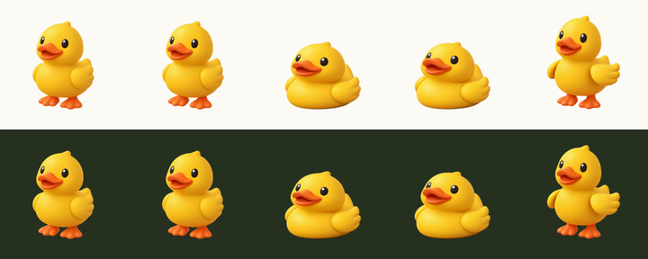

# animated-3d-icon

A Claude Code skill that turns a prompt into a **looping animated 3D icon with
real transparency** — an animated WebP you can drop straight into an app.

<p align="center">
  
</p>

No Lottie conversion, no new native dependency. `expo-image`, Chrome and Safari
all render animated WebP with alpha natively.

## Install

```
/plugin marketplace add samyost/animated-3d-icon
/plugin install animated-3d-icon
```

Or clone it and symlink the skill:

```bash
git clone https://github.com/samyost/animated-3d-icon
ln -s "$PWD/animated-3d-icon/skills/animated-3d-icon" ~/.claude/skills/
```

Then:

```bash
cd skills/animated-3d-icon
pip install -r requirements.txt
cp .env.example .env          # one OpenRouter key covers the whole pipeline
```

`ffmpeg` must be on PATH. The first run downloads a ~180MB matting model.

## Use

Ask for it in plain words:

> make an animated 3d fire icon

It generates one still, shows it, and waits for you to approve it before
spending anything on motion. Then it proposes the motion and waits again.

Under the hood:

```bash
python -m iconloop --out out still   --prompt "a 3D stopwatch, sage green and cream"
python -m iconloop --out out animate --strategy native --energy lively
python -m iconloop --out out matte
python -m iconloop --out out encode --sweep      # what each frame rate costs
python -m iconloop --out out encode --size 288 --name timer
python -m iconloop --out out verify
```

Roughly **$0.90 and four minutes** per icon.

## How it works

| stage | what happens |
|---|---|
| `still` | GPT Image / Nano Banana / OpenRouter, newest model resolved at runtime |
| `animate` | Seedance via OpenRouter, first frame **and last frame** |
| `matte` | rembg for alpha, then an exact unpremultiply for the colour |
| `encode` | animated WebP with soft alpha; WebM and MP4 optional |
| `verify` | measures whether it actually moved, and whether the loop closes |

## Three ideas worth stealing

**1. The last frame is the first frame.** Give the video model your start image
as its end image too and it returns to the opening pose, so the loop closes
instead of ping-ponging. Measured on one icon: the seam is *smaller* than an
average frame step.

**2. Composite onto a backing you chose.** The model cannot take alpha, so the
still is flattened onto a known mid-grey. Because the colour is known exactly,
matting solves `C = (F − (1−a)·BG)/a` for the true foreground instead of
estimating it — edge error 26.9 → 15.9 against ground truth.

**3. Encode at the source frame rate.** Sampling 24fps down to 8fps to hit a
file-size target is the single easiest way to ruin one of these. It produces
judder that looks like a bad render, bad matting or a bad player, and is none
of those. `--sweep` prints what each rate actually costs.

## Choosing the motion

The one question that decides everything: **what does this object do when left
alone?**

| answer | `--strategy` |
|---|---|
| It moves by itself — flows, burns, beats | `native` |
| Nothing. It is inert until used | `event` |
| Nothing, but one part is loose or hinged | `part` |
| Nothing, and it has no moving parts | `surface` |

Most icons are inert. Asking an inert object to "move naturally" is what gets
you a turntable spin.

`--energy still | calm | lively | playful` decides how much the object itself
moves. `--emit` lets it throw off a spark or a fragment.

## Limits

The soft contact shadow does not survive matting, file size scales with frame
count, transparent MP4 needs an x265 build most distros don't ship, and
animated WebP can't honour reduced-motion. All measured, with numbers, in
[docs/limitations.md](skills/animated-3d-icon/docs/limitations.md).

## Licence

MIT.
